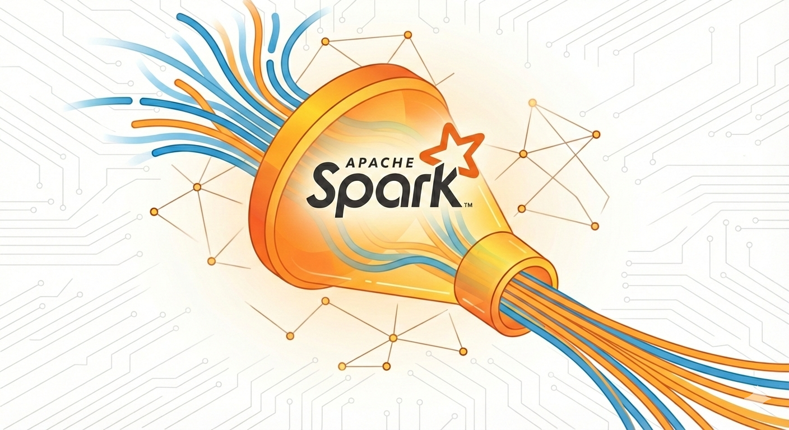
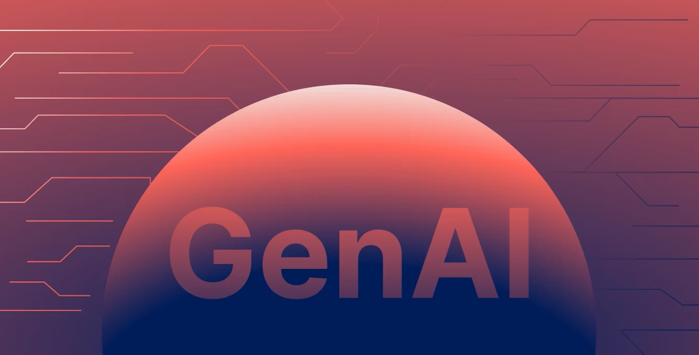
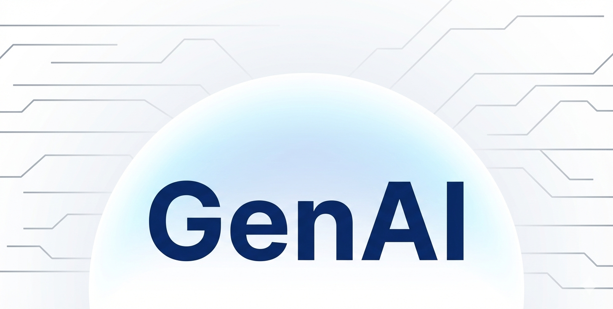

## Hi there 👋, I'm Mohamed Adhil

## 🙋‍♂️ About me

I'm from the Tamil Nadu, India📍. I'm a huge fan of Python, data processing with python, artificial intelligence, open-source, and writing optimized codes 💻.

## 🔭 I'm currently working on

<!--  -->

## 🌱 I’m currently learning

<!--  -->

## 🔨 I've contributed to

<!-- ## ✍️ I've written about

 -->

## 📫 How to reach me

